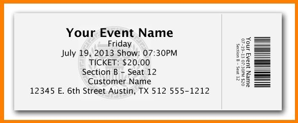

# Visual Question Answering by Optical Character Recognition

The model receives images and extracts the text considering the distancing aspects of each content. Lastly, the LLM pipleine is created to receive a prompt template as well as question of the user. The default model is created on LLAMA2 model quantized by Bloke. To use the LLM storage space of almost 8G as well as GPU is required.   
Also for OCR you may use [Tesseract](https://github.com/UB-Mannheim/tesseract/wiki) for installation guide.
The GPT4 based version of model also is available on VQA_OCR_GPT branch. 


<hr>

<h2>Input image</h2>

<hr>

Question
```
What is the date of event?
```

Instruction (optional)
```
Answer short
```

Result
```
The event takes place on Friday July 19, 2013
```
